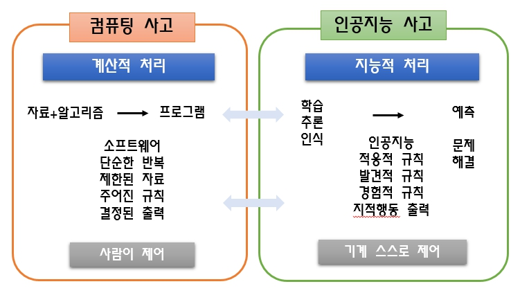

<br>

# 1. 컴퓨팅 사고

컴퓨팅 사고(Computational Thinking)는 문제를 해결하기 위해 컴퓨터 과학의 사고 방식을 적용하는 접근법입니다. 
네 가지 주요 개념인 문제 분해(Decomposition), 패턴 인식(Pattern Recognition), 추상화(Abstraction), **알고리즘 설계(Algorithm Design)**는 문제 해결을 위한 효과적인 방법을 제공합니다. 

<br>

## 1-1. 문제 분해 (Decomposition)

문제 분해는 복잡한 문제를 더 작은, 관리 가능한 하위 문제로 나누는 과정입니다. 이를 통해 각 하위 문제를 개별적으로 해결할 수 있습니다.

<br>

### 예제: 학생 성적 관리 시스템

문제: 학생들의 성적을 관리하는 시스템을 구현해야 합니다.

**문제 분해**

1. 성적 입력: 학생의 이름과 성적을 입력 받는 기능.
2. 성적 저장: 입력된 성적을 데이터베이스나 파일에 저장하는 기능.
3. 성적 조회: 특정 학생의 성적을 조회하는 기능.
4. 성적 분석: 성적을 분석하여 평균, 최고 점수, 최저 점수를 계산하는 기능.
5. 보고서 생성: 성적 분석 결과를 보고서 형식으로 출력하는 기능.

**ch01/ex01.py**

```python
# 성적 입력
def input_grades():
    grades = {}
    while True:
        name = input("Enter student's name (or 'quit' to stop): ")
        if name == 'quit':
            break
        grade = float(input(f"Enter {name}'s grade: "))
        grades[name] = grade
    return grades

# 성적 저장
def save_grades(grades, filename):
    with open(filename, 'w') as f:
        for name, grade in grades.items():
            f.write(f"{name},{grade}\n")

# 성적 조회
def read_grades(filename):
    grades = {}
    with open(filename, 'r') as f:
        for line in f:
            name, grade = line.strip().split(',')
            grades[name] = float(grade)
    return grades

# 성적 분석
def analyze_grades(grades):
    if not grades:
        return None, None, None
    avg_grade = sum(grades.values()) / len(grades)
    max_grade = max(grades.values())
    min_grade = min(grades.values())
    return avg_grade, max_grade, min_grade

# 보고서 생성
def generate_report(avg_grade, max_grade, min_grade):
    print(f"Average Grade: {avg_grade:.2f}")
    print(f"Highest Grade: {max_grade:.2f}")
    print(f"Lowest Grade: {min_grade:.2f}")

# 메인 프로그램
grades = input_grades()
save_grades(grades, 'grades.txt')
grades = read_grades('grades.txt')
avg_grade, max_grade, min_grade = analyze_grades(grades)
generate_report(avg_grade, max_grade, min_grade)
```

<br><br><br>

## 1-2. 패턴 인식 (Pattern Recognition)

패턴 인식은 데이터를 분석하여 반복적으로 발생하는 패턴이나 경향을 찾는 과정입니다. 이를 통해 문제 해결의 방향을 정할 수 있습니다.

<br>

### 예제: 이메일 필터링

문제: 스팸 이메일을 필터링해야 합니다.

**패턴 인식**

1. 스팸 이메일에는 일반적으로 "무료", "할인", "긴급", "한정", "구매"와 같은 단어가 포함되어 있습니다.
2. 스팸 이메일의 발신자는 종종 알려지지 않은 이메일 주소입니다.

**ch01/ex02.py**

```python
import re

def is_spam(email_content):
    spam_keywords = ['free', 'discount', 'urgent', 'limited', 'buy']
    email_content = email_content.lower()
    
    for keyword in spam_keywords:
        if keyword in email_content:
            return True
    
    return False

# 예제 이메일 내용
email1 = "Congratulations! You have won a FREE gift card. Click here to claim it."
email2 = "Meeting Reminder: Team meeting at 3 PM tomorrow."

print(f"Email 1 is spam: {is_spam(email1)}")
print(f"Email 2 is spam: {is_spam(email2)}")
```

<br><br><br>

## 1-3. 추상화 (Abstraction)

추상화는 문제를 단순화하기 위해 세부적인 정보나 복잡성을 생략하고 핵심 개념만을 다루는 과정입니다.

<br>

### 예제: 계산기 프로그램

문제: 계산기를 구현해야 합니다.

**추상화**

1. 기본 연산: 덧셈, 뺄셈, 곱셈, 나눗셈

2. 사용자 인터페이스: 사용자가 연산자를 선택하고 두 숫자를 입력할 수 있는 간단한 인터페이스

**ch01/ex03.py**

```python
def calculator():
    print("Welcome to the simple calculator!")
    print("Select operation: +, -, *, /")
    operation = input("Operation: ")

    num1 = float(input("Enter first number: "))
    num2 = float(input("Enter second number: "))

    if operation == '+':
        result = num1 + num2
    elif operation == '-':
        result = num1 - num2
    elif operation == '*':
        result = num1 * num2
    elif operation == '/':
        if num2 != 0:
            result = num1 / num2
        else:
            return "Error: Division by zero!"
    else:
        return "Invalid operation!"

    return f"Result: {result}"

print(calculator())
```

<br><br><br>

## 1-4. 알고리즘 설계 (Algorithm Design)

알고리즘 설계는 문제를 해결하기 위해 단계별로 명확한 절차를 정의하는 과정입니다.

<br>

### 예제: 버블 정렬 알고리즘

문제: 숫자 리스트를 오름차순으로 정렬해야 합니다.

**알고리즘 설계**

1. 리스트의 모든 요소를 순회합니다.
2. 현재 요소와 다음 요소를 비교합니다.
3. 현재 요소가 다음 요소보다 크면 두 요소의 위치를 교환합니다.
4. 리스트의 끝까지 도달하면 다시 처음부터 반복합니다.
5. 리스트가 정렬될 때까지 반복합니다.

**ch01/ex04.py**

```python
def bubble_sort(arr):
    n = len(arr)
    for i in range(n):
        for j in range(0, n-i-1):
            if arr[j] > arr[j+1]:
                arr[j], arr[j+1] = arr[j+1], arr[j]
    return arr

# 예제 리스트
arr = [64, 25, 12, 22, 11]
print(f"Original list: {arr}")
sorted_arr = bubble_sort(arr)
print(f"Sorted list: {sorted_arr}")
```

<br><br>

## 1-5. 컴퓨팅 사고 전 과정 실습

**ch01/ex05.py**

```python
# 문제 분해 예제
def input_grades():
    grades = {}
    while True:
        name = input("Enter student's name (or 'quit' to stop): ")
        if name == 'quit':
            break
        grade = float(input(f"Enter {name}'s grade: "))
        grades[name] = grade
    return grades

def save_grades(grades, filename):
    with open(filename, 'w') as f:
        for name, grade in grades.items():
            f.write(f"{name},{grade}\n")

def read_grades(filename):
    grades = {}
    with open(filename, 'r') as f:
        for line in f:
            name, grade = line.strip().split(',')
            grades[name] = float(grade)
    return grades

def analyze_grades(grades):
    if not grades:
        return None, None, None
    avg_grade = sum(grades.values()) / len(grades)
    max_grade = max(grades.values())
    min_grade = min(grades.values())
    return avg_grade, max_grade, min_grade

def generate_report(avg_grade, max_grade, min_grade):
    print(f"Average Grade: {avg_grade:.2f}")
    print(f"Highest Grade: {max_grade:.2f}")
    print(f"Lowest Grade: {min_grade:.2f}")

grades = input_grades()
save_grades(grades, 'grades.txt')
grades = read_grades('grades.txt')
avg_grade, max_grade, min_grade = analyze_grades(grades)
generate_report(avg_grade, max_grade, min_grade)

# 패턴 인식 예제
import re

def is_spam(email_content):
    spam_keywords = ['free', 'discount', 'urgent', 'limited', 'buy']
    email_content = email_content.lower()
    
    for keyword in spam_keywords:
        if keyword in email_content:
            return True
    
    return False

email1 = "Congratulations! You have won a FREE gift card. Click here to claim it."
email2 = "Meeting Reminder: Team meeting at 3 PM tomorrow."

print(f"Email 1 is spam: {is_spam(email1)}")
print(f"Email 2 is spam: {is_spam(email2)}")

# 추상화 예제
def calculator():
    print("Welcome to the simple calculator!")
    print("Select operation: +, -, *, /")
    operation = input("Operation: ")

    num1 = float(input("Enter first number: "))
    num2 = float(input("Enter second number: "))

    if operation == '+':
        result = num1 + num2
    elif operation == '-':
        result = num1 - num2
    elif operation == '*':
        result = num1 * num2
    elif operation == '/':
        if num2 != 0:
            result = num1 / num2
        else:
            return "Error: Division by zero!"
    else:
        return "Invalid operation!"

    return f"Result: {result}"

print(calculator())

# 알고리즘 설계 예제
def bubble_sort(arr):
    n = len(arr)
    for i in range(n):
        for j in range(0, n-i-1):
            if arr[j] > arr[j+1]:
                arr[j], arr[j+1] = arr[j+1], arr[j]
    return arr

arr = [64, 25, 12, 22, 11]
print(f"Original list: {arr}")
sorted_arr = bubble_sort(arr)
print(f"Sorted list: {sorted_arr}")
```

<br><br><br>

# 2. 인공지능 사고

인공지능 사고에서 중요한 네 가지 개념인 데이터 리터러시(Data Literacy), 비판적 사고(Critical Thinking), 윤리적 사고(Ethical Thinking), **창의적 사고(Creative Thinking)**는 데이터와 AI 기술을 활용하여 문제를 해결하는 데 필수적인 능력입니다. 

<br>

## 2-1. 데이터 리터러시 (Data Literacy)

데이터 리터러시는 데이터를 이해하고 분석하며, 그 결과를 바탕으로 의미 있는 결론을 도출하는 능력입니다. 데이터 리터러시는 데이터를 수집하고, 정제하며, 시각화하고, 분석하는 능력을 포함합니다.

<br>

### 데이터 리터러시 활용

문제: 고객의 구매 패턴을 분석하여 마케팅 전략을 개선하려고 합니다.

**프로세스**

1. 데이터 수집: 고객의 구매 기록을 수집합니다.
2. 데이터 정제: 결측값을 처리하고 이상치를 제거합니다.
3. 데이터 분석: 고객의 구매 빈도, 평균 구매 금액 등을 분석합니다.
4. 데이터 시각화: 구매 패턴을 시각화하여 인사이트를 도출합니다.

**ch02/ex01.py**

```python
import pandas as pd
import matplotlib.pyplot as plt

# 데이터 수집
data = {
    'Customer': ['A', 'B', 'C', 'D', 'E'],
    'Purchase_Amount': [100, 150, 200, 250, 300],
    'Frequency': [5, 6, 7, 8, 9]
}
df = pd.DataFrame(data)

# 데이터 시각화
plt.figure(figsize=(10, 5))

# 구매 금액 시각화
plt.subplot(1, 2, 1)
plt.bar(df['Customer'], df['Purchase_Amount'])
plt.title('Purchase Amount by Customer')
plt.xlabel('Customer')
plt.ylabel('Amount')

# 구매 빈도 시각화
plt.subplot(1, 2, 2)
plt.bar(df['Customer'], df['Frequency'])
plt.title('Purchase Frequency by Customer')
plt.xlabel('Customer')
plt.ylabel('Frequency')

plt.tight_layout()
plt.show()
```

<br><br><br>

## 2-2. 비판적 사고 (Critical Thinking)

비판적 사고는 정보를 분석하고 평가하여 논리적이고 합리적인 결론을 도출하는 능력입니다. 이 과정은 가설을 세우고, 증거를 수집하며, 논리적인 오류를 찾는 것 등을 포함합니다.

<br>

### 비판적 사고 활용

문제: AI 모델이 잘못된 예측을 하고 있습니다. 왜 그런지 분석하고 싶습니다.

**프로세스**

1. 문제 정의: AI 모델의 예측 오류가 발생하고 있습니다.
2. 데이터 분석: 모델의 예측 결과와 실제 값을 비교합니다.
3. 가설 검증: 예측 오류의 원인을 가설을 세우고 검증합니다.
4. 결론 도출: 분석 결과에 따라 모델을 개선합니다.

**ch02/ex02.py**

```python
from sklearn.metrics import confusion_matrix, classification_report

# 예측 결과와 실제 결과 (예시)
y_true = [0, 1, 1, 0, 1, 0, 1, 0]
y_pred = [0, 0, 1, 0, 1, 1, 0, 0]

# 혼동 행렬과 분류 리포트
cm = confusion_matrix(y_true, y_pred)
cr = classification_report(y_true, y_pred)

print("Confusion Matrix:")
print(cm)
print("\nClassification Report:")
print(cr)
```

<br><br><br>

## 2-3. 윤리적 사고 (Ethical Thinking)

윤리적 사고는 기술과 데이터의 사용이 사회적, 법적, 윤리적 기준에 부합하는지 평가하는 능력입니다. 데이터의 프라이버시와 보안, 공정성을 고려하는 것이 포함됩니다.

<br>

### 윤리적 사고 활용

문제: AI 모델을 사용하여 대출 심사를 자동화할 때, 데이터의 공정성을 보장하고 싶습니다.

**프로세스**

1. 데이터 수집: 대출 심사에 사용되는 데이터를 수집합니다.
2. 데이터 검토: 데이터가 특정 그룹에 대한 편향을 포함하고 있는지 확인합니다.
3. 모델 평가: AI 모델이 모든 집단에 대해 공정한지 평가합니다.
4. 조치 계획: 편향을 제거하기 위한 조치를 계획하고 실행합니다.

**ch02/ex03.py**

```python
import pandas as pd

# 데이터 수집 (예시 데이터)
data = pd.DataFrame({
    'Applicant': ['A', 'B', 'C', 'D', 'E'],
    'Income': [50000, 60000, 55000, 70000, 80000],
    'Loan_Amount': [10000, 12000, 11000, 14000, 16000],
    'Approved': [1, 0, 1, 1, 0]
})

# 편향 확인
grouped_data = data.groupby('Approved').mean()
print("Average Loan Amount by Approval Status:")
print(grouped_data)
```

<br><br><br>

## 2-4. 창의적 사고 (Creative Thinking)

창의적 사고는 문제를 새로운 방식으로 접근하고 혁신적인 아이디어를 생성하는 능력입니다. 이는 문제를 해결하기 위한 독창적이고 혁신적인 해결책을 모색하는 과정입니다.

<br>

### AI를 활용한 창의적 문제 해결 방법

문제: 고객의 피드백을 자동으로 분석하여 제품 개선점을 도출하고 싶습니다.

**프로세스**

1. 문제 정의: 고객의 피드백을 분석하여 제품의 개선점을 찾고 싶습니다.
2. 데이터 수집: 고객의 피드백 데이터를 수집합니다.
3. 자연어 처리: 텍스트 데이터를 처리하고 분석합니다.
4. 모델 개발: 감정 분석 모델을 개발하여 피드백의 감정을 분석합니다.
5. 결과 활용: 분석 결과를 바탕으로 제품 개선점을 도출합니다.

**ch02/ex04.py**

```python
from textblob import TextBlob
import pandas as pd

# 고객 피드백 데이터
feedback = pd.DataFrame({
    'Customer': ['A', 'B', 'C', 'D'],
    'Feedback': [
        'I love the new feature, it is fantastic!',
        'The product is okay, but the delivery was slow.',
        'I am not satisfied with the product quality.',
        'Great service and fast delivery!'
    ]
})

# 감정 분석
def analyze_sentiment(feedback_text):
    analysis = TextBlob(feedback_text)
    return analysis.sentiment.polarity

feedback['Sentiment'] = feedback['Feedback'].apply(analyze_sentiment)
print("Customer Feedback with Sentiment Analysis:")
print(feedback)
```

<br><br>

## 2-5. 인공지능 사고의 실습

**ch02/ex05.py**

```python
# 데이터 리터러시 예제
import pandas as pd
import matplotlib.pyplot as plt

data = {
    'Customer': ['A', 'B', 'C', 'D', 'E'],
    'Purchase_Amount': [100, 150, 200, 250, 300],
    'Frequency': [5, 6, 7, 8, 9]
}
df = pd.DataFrame(data)

plt.figure(figsize=(10, 5))

plt.subplot(1, 2, 1)
plt.bar(df['Customer'], df['Purchase_Amount'])
plt.title('Purchase Amount by Customer')
plt.xlabel('Customer')
plt.ylabel('Amount')

plt.subplot(1, 2, 2)
plt.bar(df['Customer'], df['Frequency'])
plt.title('Purchase Frequency by Customer')
plt.xlabel('Customer')
plt.ylabel('Frequency')

plt.tight_layout()
plt.show()

# 비판적 사고 예제
from sklearn.metrics import confusion_matrix, classification_report

y_true = [0, 1, 1, 0, 1, 0, 1, 0]
y_pred = [0, 0, 1, 0, 1, 1, 0, 0]

cm = confusion_matrix(y_true, y_pred)
cr = classification_report(y_true, y_pred)

print("Confusion Matrix:")
print(cm)
print("\nClassification Report:")
print(cr)

# 윤리적 사고 예제
import pandas as pd

data = pd.DataFrame({
    'Applicant': ['A', 'B', 'C', 'D', 'E'],
    'Income': [50000, 60000, 55000, 70000, 80000],
    'Loan_Amount': [10000, 12000, 11000, 14000, 16000],
    'Approved': [1, 0, 1, 1, 0]
})

grouped_data = data.groupby('Approved').mean()
print("Average Loan Amount by Approval Status:")
print(grouped_data)

# 창의적 사고 예제
from textblob import TextBlob
import pandas as pd

feedback = pd.DataFrame({
    'Customer': ['A', 'B', 'C', 'D'],
    'Feedback': [
        'I love the new feature, it is fantastic!',
        'The product is okay, but the delivery was slow.',
        'I am not satisfied with the product quality.',
        'Great service and fast delivery!'
    ]
})

def analyze_sentiment(feedback_text):
    analysis = TextBlob(feedback_text)
    return analysis.sentiment.polarity

feedback['Sentiment'] = feedback['Feedback'].apply(analyze_sentiment)
print("Customer Feedback with Sentiment Analysis:")
print(feedback)
```

<br><br><br><br>

# 3. 인공지능 사고력 교육

인공지능 사고력의 교육은 다양한 측면에서 학생들의 문제 해결 능력과 사고 능력을 개발하는 데 중점을 둡니다. 아래는 창의적 문제 해결(Creative Problem Solving), 예측 및 의사결정(Prediction and Decision Making), 적응적 학습(Adaptive Learning), 협력적 사고(Collaborative Thinking), 윤리적 사고(Ethical Thinking), 감성적 지능(Emotional Intelligence), 시스템적 사고(Systems Thinking), **지속적 개선(Continuous Improvement)**의 설명과 실습 예제입니다.

<br>

## 3-1. 창의적 문제 해결 (Creative Problem Solving)

- 창의적 문제 해결은 기존의 방법과 다르게 새로운 접근 방식을 적용하여 문제를 해결하는 과정입니다. 문제를 다양한 시각에서 바라보고 독창적인 해결책을 찾는 것이 핵심입니다.

<br>

문제: 가상의 회사가 고객 피드백을 개선하기 위해 새로운 방법을 찾아야 합니다.

**ch03/ex01.py**

```python
# 고객 피드백을 분석하여 개선점을 도출하는 창의적 방법

import pandas as pd
import matplotlib.pyplot as plt
from textblob import TextBlob

# 고객 피드백 데이터
feedback_data = pd.DataFrame({
    'Customer': ['A', 'B', 'C', 'D'],
    'Feedback': [
        'The service was excellent but the wait time was long.',
        'I loved the product but the customer support was unresponsive.',
        'The quality was poor but delivery was fast.',
        'Great overall experience but the pricing was high.'
    ]
})

# 감성 분석을 통한 피드백 개선점 도출
def analyze_sentiment(feedback):
    analysis = TextBlob(feedback)
    return analysis.sentiment.polarity

feedback_data['Sentiment'] = feedback_data['Feedback'].apply(analyze_sentiment)

# 피드백 개선점을 시각화
plt.bar(feedback_data['Customer'], feedback_data['Sentiment'])
plt.xlabel('Customer')
plt.ylabel('Sentiment Score')
plt.title('Customer Feedback Sentiment Analysis')
plt.show()
```

<br><br><br>

## 3-2. 예측 및 의사결정 (Prediction and Decision Making)

- 예측 및 의사결정은 데이터와 모델을 기반으로 미래의 결과를 예측하고 이를 바탕으로 결정을 내리는 과정입니다. 데이터 분석과 통계적 기법을 활용하여 최적의 결정을 도출합니다.

<br>

문제: 판매 데이터를 바탕으로 향후 매출을 예측하고, 마케팅 전략을 결정합니다.

**ch03/ex02.py**

```python
import pandas as pd
from sklearn.linear_model import LinearRegression
import numpy as np
import matplotlib.pyplot as plt

# 가상의 판매 데이터
data = pd.DataFrame({
    'Month': np.arange(1, 13),
    'Sales': [200, 210, 215, 220, 230, 240, 245, 250, 260, 270, 275, 280]
})

# 독립 변수와 종속 변수
X = data[['Month']]
y = data['Sales']

# 모델 훈련
model = LinearRegression()
model.fit(X, y)

# 향후 6개월 예측
future_months = np.arange(13, 19).reshape(-1, 1)
predictions = model.predict(future_months)

# 예측 결과 시각화
plt.plot(data['Month'], data['Sales'], label='Historical Sales')
plt.plot(np.arange(1, 19), np.concatenate([y, predictions]), '--', label='Predicted Sales')
plt.xlabel('Month')
plt.ylabel('Sales')
plt.title('Sales Prediction')
plt.legend()
plt.show()
```

<br><br><br>

## 3-3. 적응적 학습 (Adaptive Learning)

- 적응적 학습은 학습자의 성과와 필요에 따라 학습 경험을 맞춤화하는 과정입니다. 학습자의 성과에 따라 학습 자료와 접근 방법을 조정합니다.

<br>

문제: 온라인 학습 플랫폼에서 학생들의 성과에 따라 적절한 학습 자료를 제공하는 시스템을 개발합니다.

**ch03/ex03.py**

```python
import pandas as pd
from sklearn.preprocessing import StandardScaler
from sklearn.cluster import KMeans

# 학생 성과 데이터
data = pd.DataFrame({
    'Student': ['A', 'B', 'C', 'D', 'E'],
    'Score': [90, 80, 70, 60, 50]
})

# 데이터 정규화
scaler = StandardScaler()
data_scaled = scaler.fit_transform(data[['Score']])

# K-평균 군집화
kmeans = KMeans(n_clusters=2, random_state=0).fit(data_scaled)
data['Cluster'] = kmeans.labels_

# 적절한 학습 자료 제공
learning_materials = {0: 'Advanced Topics', 1: 'Basic Topics'}

data['Recommended_Material'] = data['Cluster'].map(learning_materials)
print(data)
```

<br><br><br>

## 3-4. 협력적 사고 (Collaborative Thinking)

- 협력적 사고는 팀원들과의 협업을 통해 문제를 해결하는 능력입니다. 공동의 목표를 가지고 팀원들과 협력하여 해결책을 모색합니다.

<br>

문제: 팀 프로젝트에서 역할 분담과 협업을 통해 제품 아이디어를 개발합니다.

**ch03/ex04.py**

```python
# 협력적 사고를 위한 팀원 역할 분담 예제

team_roles = {
    'Alice': 'Researcher',
    'Bob': 'Designer',
    'Charlie': 'Developer',
    'David': 'Tester'
}

print("Team Roles:")
for member, role in team_roles.items():
    print(f"{member}: {role}")

# 역할에 따른 업무 리스트
tasks = {
    'Researcher': ['Market Analysis', 'Competitor Analysis'],
    'Designer': ['UI/UX Design', 'Prototyping'],
    'Developer': ['Coding', 'Feature Implementation'],
    'Tester': ['Testing', 'Bug Reporting']
}

for role, task_list in tasks.items():
    print(f"\nTasks for {role}:")
    for task in task_list:
        print(f"- {task}")
```

<br><br><br>

## 3-5. 윤리적 사고 (Ethical Thinking)

- 윤리적 사고는 기술과 데이터의 사용이 윤리적 기준에 부합하는지를 평가하는 과정입니다. 데이터 프라이버시와 공정성, 사회적 책임을 고려합니다.

<br>

문제: AI 시스템의 데이터 사용이 공정하고 윤리적인지 검토합니다.

**ch03/ex05.py**

```python
import pandas as pd

# AI 데이터 예제
data = pd.DataFrame({
    'User': ['A', 'B', 'C', 'D'],
    'Usage': [10, 15, 5, 20],
    'Ethical_Concerns': ['None', 'Privacy Issue', 'Bias', 'None']
})

# 윤리적 우려 사항 분석
concern_summary = data['Ethical_Concerns'].value_counts()
print("Ethical Concerns Summary:")
print(concern_summary)

# 윤리적 우려가 있는 경우 조치 계획
for index, row in data.iterrows():
    if row['Ethical_Concerns'] != 'None':
        print(f"\nAction Plan for User {row['User']}: Address {row['Ethical_Concerns']}")
```

<br><br><br>

## 3-6. 감성적 지능 (Emotional Intelligence)

- 감성적 지능은 자신의 감정을 인식하고 관리하며, 타인의 감정을 이해하고 적절히 반응하는 능력입니다.

<br>

문제: 고객 서비스 팀이 고객의 감정을 분석하고 적절히 대응할 수 있도록 지원합니다.

**ch03/ex06.py**

```python
from textblob import TextBlob

# 고객 피드백 데이터
feedbacks = [
    "I am very happy with your service!",
    "The experience was disappointing and frustrating.",
    "I feel okay about the product, but it could be improved.",
    "Great support, but the product didn't meet my expectations."
]

# 감정 분석
def analyze_emotion(feedback):
    analysis = TextBlob(feedback)
    if analysis.sentiment.polarity > 0:
        return 'Positive'
    elif analysis.sentiment.polarity < 0:
        return 'Negative'
    else:
        return 'Neutral'

emotions = [analyze_emotion(feedback) for feedback in feedbacks]
print("Customer Feedback Emotions:")
for feedback, emotion in zip(feedbacks, emotions):
    print(f"Feedback: '{feedback}' - Emotion: {emotion}")
```

<br><br><br>

## 3-7. 시스템적 사고 (Systems Thinking)

- 시스템적 사고는 시스템의 구성 요소와 이들 간의 상호작용을 이해하여 문제를 해결하는 접근 방식입니다. 전체 시스템을 통합적으로 바라보고 문제를 해결합니다.

<br>

문제: 제조 공정의 효율성을 개선하기 위해 시스템적 접근 방식을 사용합니다.

**ch03/ex07.py**

```python
import matplotlib.pyplot as plt

# 제조 공정 데이터 예제
stages = ['Raw Materials', 'Production', 'Quality Check', 'Packaging', 'Distribution']
efficiency = [70, 80, 90, 85, 75]

# 시스템적 접근 시각화
plt.plot(stages, efficiency, marker='o')
plt.xlabel('Manufacturing Stages')
plt.ylabel('Efficiency (%)')
plt.title('Manufacturing Process Efficiency')
plt.grid(True)
plt.show()
```

<br><br><br>

## 3-8. 지속적 개선 (Continuous Improvement)

- 지속적 개선은 제품이나 과정의 성능을 지속적으로 향상시키기 위해 반복적인 개선을 수행하는 과정입니다. 작은 개선을 통해 장기적인 발전을 추구합니다.

<br>

문제: 소프트웨어 개발 프로젝트의 품질을 개선하기 위한 지속적 개선 프로세스를 구현합니다.

**ch03/ex08.py**

```python
import pandas as pd

# 품질 지표 데이터
data = pd.DataFrame({
    'Month': ['Jan', 'Feb', 'Mar', 'Apr', 'May'],
    'Bug_Count': [10, 8, 6, 4, 2]
})

# 개선 추세 시각화
data['Bug_Count'].plot(kind='line', marker='o')
plt.xlabel('Month')
plt.ylabel('Bug Count')
plt.title('Bug Count Over Time')
plt.grid(True)
plt.show()
```

